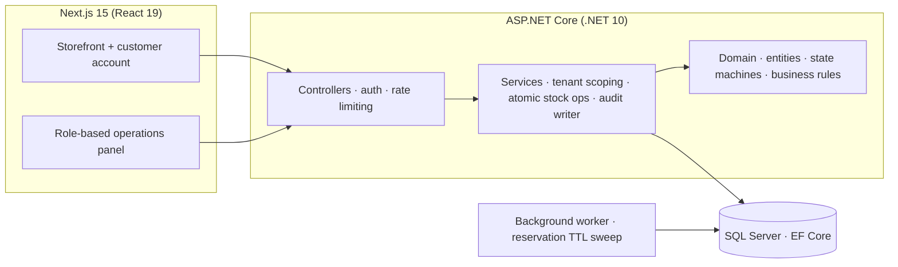
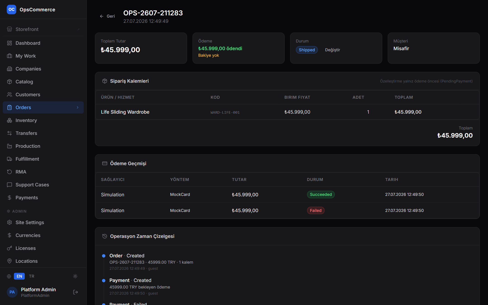
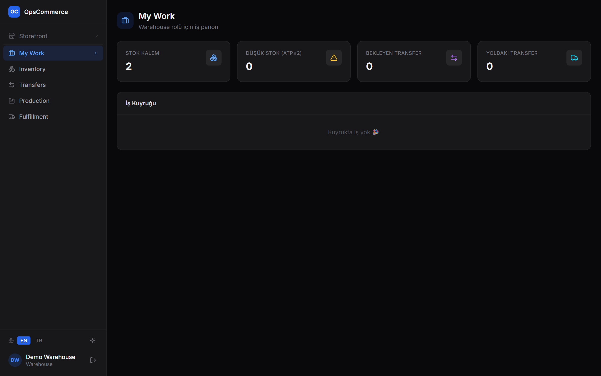
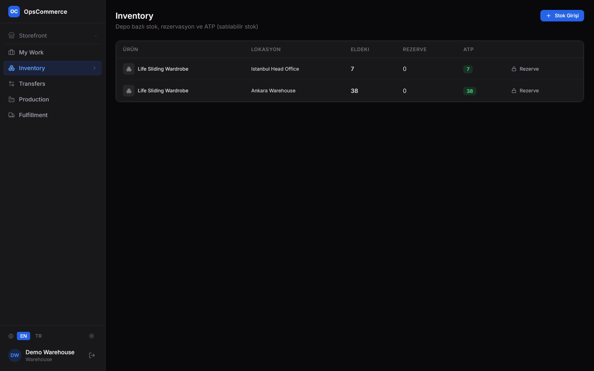
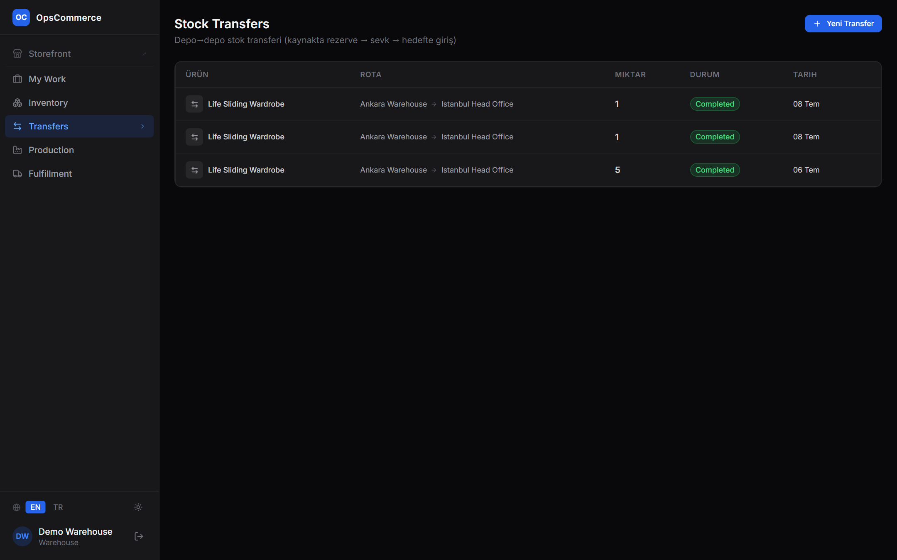
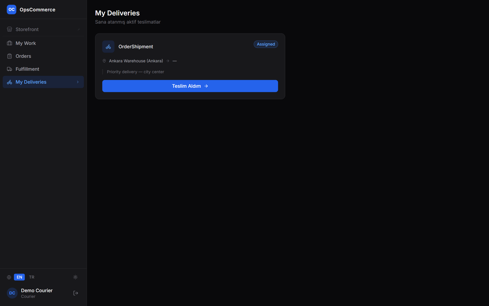
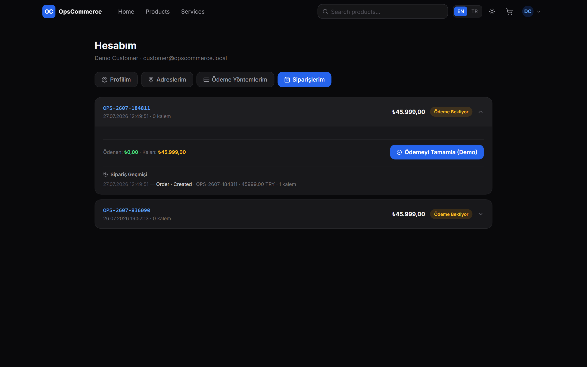

# OpsCommerce

**An operations-first commerce platform** — not just a storefront, but the full engine behind it: order lifecycle, deposit-based payments, warehouse inventory with overselling protection, courier delivery, returns (RMA), production orders and a complete operational audit trail.


> **About this repository.** OpsCommerce is a private, full-stack project. This public repository is a **curated showcase**: it contains the complete domain core (which builds and its tests run in CI — see the badge), the architecture and data-model documentation, and commented highlights from the service layer. The full application (API, frontend, infrastructure) is private. See [LICENSE](LICENSE).

---

## Why this project exists

Most demo shops stop at "add to cart, pay, done". Real commerce is won or lost **after** the payment: who reserves the stock, which warehouse ships it, which courier carries it, what happens when the customer returns it. OpsCommerce is built around that operational side:

- A **seller** can allow deposit-based selling per product (pay 30% now, the balance later).
- A **warehouse worker** sees stock with Available-To-Promise numbers and moves goods between warehouses.
- A **courier** gets assigned deliveries and advances them step by step on their own screen.
- A **customer** manages addresses, tracks orders and opens return/exchange/repair requests.
- Every action lands in an **audit trail**, so any order can be replayed as a step-by-step story:

```
Order    · Created          · ORD-2607-269816 · 45,999.00 TRY · 1 item
Payment  · Created          · 45,999.00 TRY pending
Payment  · Failed           · simulated failure
Order    · PaymentFailed
Payment  · Succeeded        · 45,999.00 TRY collected
Order    · PaymentReceived  · paid 45,999.00 / 45,999.00 → Paid
Order    · StatusChanged    · Paid → Processing
Order    · StatusChanged    · Processing → Shipped
```
*(real output from the activity-log API)*

## Feature matrix

| Area | What it does |
|---|---|
| **Orders** | Guarded lifecycle (state machine), server-authoritative pricing, per-order line customization without touching the global product |
| **Payments** | Full or deposit + balance; failed payments are retryable (`PaymentFailed`, not `Cancelled`); concurrent double-confirmation is blocked by an atomic claim |
| **Inventory** | Per-warehouse stock, ATP = on-hand − reserved, atomic reservations (no overselling under concurrency), TTL reservations auto-released by a background worker |
| **Warehouse transfers** | Draft → Dispatched → Completed with real stock effects at each step |
| **Fulfillment & couriers** | Auto-created on full payment; courier assignment; couriers advance only their own deliveries, in the right order |
| **RMA** | Return / exchange / repair with ownership checks, quantity and refund limits, automatic restock + refund effects |
| **Production** | Make-to-stock orders that feed inventory on completion |
| **Multi-tenant** | Company-scoped data access on every query and command; role-based panels (admin, company, operations, warehouse, courier, call center, customer) |
| **Audit trail** | Every operational action logged atomically with the operation itself, linked to order and actor |

## Architecture at a glance



- **Domain layer** (in this repo, `src/OpsCommerce.Domain`) holds the business rules: entities, guarded state machines, invariants. It has **zero dependencies** — no EF, no ASP.NET — which is why its 31 tests run in under a second.
- **Service layer** (private; excerpts in [`code-highlights/`](code-highlights/)) owns tenant scoping, transactions and the concurrency-critical stock operations.
- **API layer** maps domain errors to stable HTTP responses: every `BusinessRuleException` becomes a `422` with a machine-readable `errorCode`.

More detail: [architecture](docs/architecture.md) · [domain model & state machines](docs/domain-model.md) · [data model](docs/data-model.md) · [operations flows](docs/operations.md)

## Engineering practices

- **State machines everywhere.** Six entities have explicit transition maps. An order that was never paid cannot be shipped; a courier cannot complete a delivery without arriving first. Invalid jumps are `422`s, not silent data corruption.
- **Concurrency without locks.** Stock reservation is a single conditional `UPDATE … WHERE onHand − reserved >= qty`. If two checkouts race for the last unit, exactly one wins. No distributed locks, no retry loops. ([details](code-highlights/atomic-reservation.md))
- **Security as a process.** The codebase went through an internal security review (authorization scoping, server-authoritative pricing, brute-force protection, tenant isolation). Findings, fixes and how each fix was verified live are documented in [docs/security.md](docs/security.md).
- **Honest testing.** 85+ unit tests in the full project; the 31 domain tests run here in CI. The [testing doc](docs/testing.md) also explains what unit tests *cannot* cover in this design (raw-SQL concurrency paths) and how those are verified instead.
- **CI/CD.** Every push builds and tests before anything deploys; the pipeline in the private repo also ships to a staging VPS via GitHub Actions. This repo runs the same build+test gate — the badge above is live. ([details](docs/ci-cd.md))

## Repository map

```
├── src/OpsCommerce.Domain/     ← complete domain core (builds, tested in CI)
│   ├── Common/                 ← StateMachine, base entities, domain exceptions
│   ├── Orders/  Payments/      ← order lifecycle, deposits, payment guards
│   ├── Inventory/              ← ATP stock, TTL reservations, transfers
│   ├── Fulfillment/            ← deliveries and courier flow
│   ├── Production/  Rma/       ← make-to-stock, returns/exchange/repair
│   └── Activity/               ← audit-trail entry
├── tests/OpsCommerce.Domain.Tests/  ← 31 tests, plain xUnit, no mocks needed
├── docs/                       ← architecture, data model, security, testing, API
├── code-highlights/            ← commented service-layer excerpts (read-only)
└── assets/                     ← screenshots
```

## Running the tests

```bash
dotnet test
```

That is all — the domain has no infrastructure dependencies.

## Tech stack

**Backend:** ASP.NET Core (.NET 10), EF Core, SQL Server, ASP.NET Identity + JWT, layered architecture
**Frontend:** Next.js 15, React 19, Tailwind CSS
**Infra:** Docker Compose, GitHub Actions CI/CD, nginx reverse proxy, Cloudflare

## Screenshots

The platform ships with an EN/TR language switcher; the operational screens below are captured in Turkish — the platform's primary market language.

| | |
|---|---|
| **Order detail with the operational timeline** — payment history shows a failed attempt followed by a successful retry; the timeline tells the whole story |  |
| **Warehouse dashboard ("My Work")** — each role gets its own metrics and work queue |  |
| **Inventory with ATP** — on-hand / reserved / available-to-promise per warehouse, with stock intake and TTL reservations |  |
| **Warehouse transfers** — stock-aware creation (source ATP, destination on-hand), dispatch and completion with real stock effects |  |
| **Courier's own screen** — assigned deliveries advanced step by step; note the role-filtered navigation |  |
| **Customer account** — order history with live status, payments and self-service return requests |  |

More: [storefront](assets/storefront.png) · [login with demo roles](assets/login.png) · [management dashboard](assets/dashboard.png) · [RMA management](assets/rma.png)

## Live demo

**https://opscommerce-demo.rapidconfigs.com** — an isolated demo environment with simulated payments and a **nightly data reset** (everything you create is wiped early morning UTC, so feel free to explore).

| Role | E-mail | What to try |
|---|---|---|
| Company admin | `company@opscommerce.local` | catalog, deposit toggle on a product, dashboard |
| Operations | `operations@opscommerce.local` | orders, status flow, RMA approval, courier assignment |
| Warehouse | `warehouse@opscommerce.local` | inventory, stock intake, reservations, transfers |
| Courier | `courier@opscommerce.local` | "My Deliveries", step-by-step delivery |
| Customer | `customer@opscommerce.local` | storefront, account area, order history, return request |

Password for all demo roles: `OpsCommerce123!` *(intentionally public — this is a sandbox).* The storefront also supports guest checkout with no login at all.

A suggested 3-minute tour: put the deposit-enabled product in the cart → check out with **"pay deposit"** → pay the balance from the success screen → log in as operations and open the order → read its timeline.

## Limitations & roadmap

This is a portfolio system, honest about what it is not (yet):

- Payments are **simulated** — a real PSP integration (iyzico / Stripe) with tokenized card storage is the next production step; the payment flow is already shaped for it (pending → claim → effects).
- Carrier integration is internal-courier only; a pluggable `IShippingProvider` abstraction is planned.
- Notifications (e-mail/SMS) and invoicing are out of scope for the demo.

---

*© 2026 — published for portfolio review. See [LICENSE](LICENSE).*
