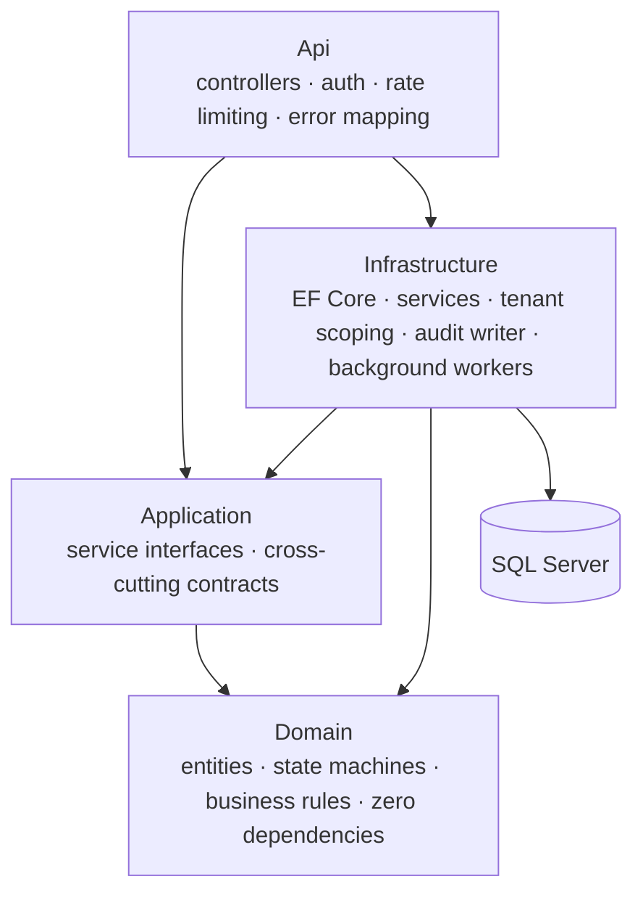
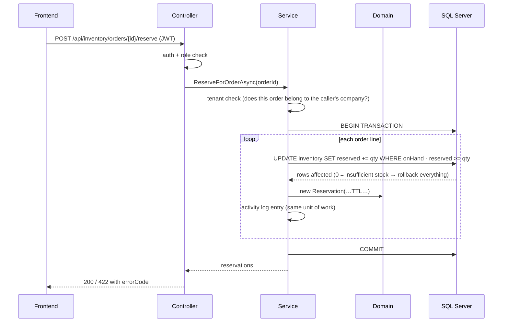

# Architecture

## Layered design

The backend is a classic layered ASP.NET Core application. The layers are strict: dependencies only point inward, and the domain layer depends on nothing.

| Layer | Responsibility | Example |
|---|---|---|
| **Domain** | Business rules that are always true, no matter who calls | "an unpaid order cannot be shipped", "a refund cannot exceed what was paid" |
| **Application** | Contracts between layers | `IInventoryService`, `IActivityLogger`, `ICurrentUserService` |
| **Infrastructure** | Everything that touches the outside world | EF Core queries, atomic SQL updates, the reservation-expiry worker |
| **Api** | HTTP concerns only | routing, JWT auth, role checks, rate limiting, exception → status-code mapping |

## Request flow

A typical write request (for example *"reserve stock for this order"*):

Two things worth noticing:

1. **All-or-nothing reservation.** The whole order is reserved in one transaction. If the third line has no stock, the first two reservations roll back too — no stock stays locked by a half-reserved order.
2. **The audit entry is part of the same transaction.** If the operation fails, no misleading log line is left behind.

## Error contract

The domain throws `BusinessRuleException` with a stable code. A middleware maps it once, centrally:

| Exception | HTTP | Body |
|---|---|---|
| `BusinessRuleException` | 422 | `{ "detail": "...", "errorCode": "INVENTORY_INSUFFICIENT" }` |
| `NotFoundException` | 404 | generic message |
| anything unexpected | 500 | generic message — internal details are logged, never sent to the client |

Clients (and tests) react to `errorCode`, not to message text. Framework exception messages are never leaked to the response.

## Multi-tenancy

Every business row carries a `CompanyId`. Access control has two gates:

1. **Role gate** at the controller (`[Authorize(Roles = …)]`) — *may this kind of user call this at all?*
2. **Tenant gate** in the service — *may this specific user touch this specific row?* A shared helper answers it: platform admins see everything; everyone else only their own company (customers only their own records).

The tenant gate is applied to queries (filtered lists) and to commands (a foreign row behaves as if it does not exist → 404, so the system does not even confirm the row exists).

## Background work

A hosted worker sweeps expired stock reservations every 60 seconds: it atomically gives the reserved quantity back and marks the reservation `Expired`, writing an audit entry as `system`. This guarantees that an abandoned checkout can never lock stock forever.

## Frontend

Two surfaces share one Next.js app:

- **Storefront** — public catalog, guest cart (client-side by design; the server is only involved from checkout on), checkout with an optional deposit toggle, and a customer account area (profile, addresses, saved payment labels, order history with a live activity timeline, RMA requests).
- **Operations panel** — a sidebar shell with role-filtered navigation. Each role lands on a "My Work" dashboard with metrics and a work queue tailored to that role (warehouse sees low stock and pending transfers; couriers see active deliveries; sellers see revenue and open orders).
