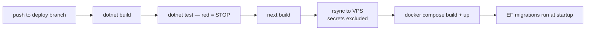

# CI/CD

## Pipeline shape

The private repository deploys through GitHub Actions with a strict gate order:

- **Tests gate the deploy.** The deploy job depends on the build+test job; a failing test means no artifact reaches the server.
- **Secrets never travel with code.** Environment files are excluded from sync and live only on the server and in CI secrets; the repo carries placeholders.
- **Migrations at startup.** Containerized environments apply EF migrations on boot, so a deploy is one atomic unit: code + schema. All migrations in the project's history are additive, which keeps this safe.
- **Branch flow.** Development happens on a dev branch; merging to the staging branch triggers the staging deploy; production deploys only from an explicitly promoted branch.

## Environments

| Environment | Purpose |
|---|---|
| Local | development against a local SQL Server |
| Staging (VPS, Docker) | every merged change lands here first and is verified live |
| Demo | public demo with seeded roles and periodic data reset |

The staging stack is Docker Compose behind an nginx reverse proxy (TLS, routing) with Cloudflare in front. SQL Server runs as a container that is **not** exposed to the internet — only the application network reaches it.

## This repository's CI

The same build+test gate runs here on every push ([workflow](../.github/workflows/ci.yml)): the domain core is compiled and its 31 tests must pass. The README badge reflects the latest run — the point is that the code you are reading is code that builds.

## Operational safety habits

- Health endpoints (`/health/live`, `/health/ready`) for container orchestration and uptime checks.
- Deploys are observed, not fire-and-forget: after each staging deploy, a scripted smoke pass hits the key flows (checkout, reservation, transfer, RMA) against the live environment.
- Transient CI/SSH hiccups are retried at the failed step only — the build artifacts are not rebuilt, so a network blip cannot produce a different binary.
