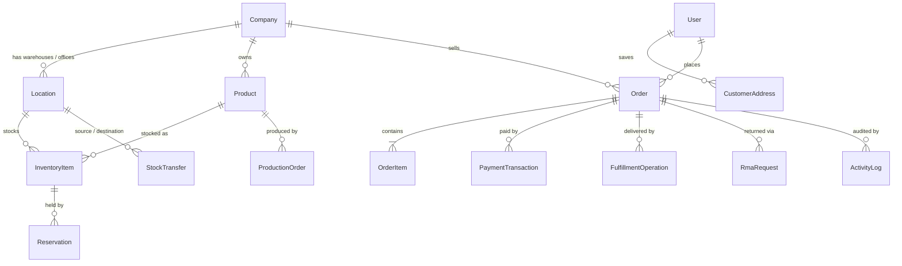

# Data model

SQL Server via EF Core, code-first with migrations. Every schema change in the project's history has been **additive** (new tables / new columns with safe defaults) — no destructive migration was ever needed, so deployments never risk existing data.

## Entity relationships (core)

## Selected table shapes

A few representative tables, as they exist in the database. Conventions shared by all tables: `Id uniqueidentifier PK`, `CreatedAtUtc` / `UpdatedAtUtc`, and soft-delete columns (`IsActive`, `IsDeleted`) combined with a global query filter — deleted rows stay for auditing but never appear in normal queries.

### Orders

| Column | Type | Notes |
|---|---|---|
| CompanyId | uniqueidentifier | tenant owner (indexed) |
| CustomerId | uniqueidentifier NULL | registered customer, if any |
| GuestToken | nvarchar NULL | guest checkout identity (indexed) |
| OrderNumber | nvarchar | unique index |
| CurrencyCode | nvarchar(3) | single currency per order, resolved server-side |
| TotalAmount | decimal(18,2) | |
| AmountPaid | decimal(18,2) | supports partial payment |
| DepositAmount | decimal(18,2) NULL | the deposit plan, if the customer chose it |
| Status | int | indexed; guarded by the state machine |

### InventoryItems

| Column | Type | Notes |
|---|---|---|
| CompanyId | uniqueidentifier | indexed |
| LocationId | uniqueidentifier | **unique together with ProductId** — one stock row per product per warehouse |
| ProductId | uniqueidentifier | indexed |
| QuantityOnHand | int | physical stock |
| QuantityReserved | int | held by reservations/transfers; ATP is computed, never stored |

The ATP value (`OnHand − Reserved`) is intentionally **not** a column: a stored copy could drift; a computed value cannot.

### Reservations

| Column | Type | Notes |
|---|---|---|
| InventoryItemId | uniqueidentifier | indexed |
| OrderId | uniqueidentifier NULL | which order holds this stock (indexed) |
| Quantity | int | |
| ExpiresAtUtc | datetime2 | **index on (Status, ExpiresAtUtc)** — the expiry worker's sweep query |
| Status | int | Active / Committed / Released / Expired |

### ActivityLogs

| Column | Type | Notes |
|---|---|---|
| CompanyId | uniqueidentifier NULL | tenant scope for queries (indexed) |
| OrderId | uniqueidentifier NULL | correlation — one order's full story (indexed) |
| EntityType | nvarchar(50) | Order / Payment / Fulfillment / Transfer / … (indexed with EntityId) |
| EntityId | uniqueidentifier | |
| Action | nvarchar(100) | Created / StatusChanged / CourierAssigned / … |
| Details | nvarchar(1000) | human-readable summary |
| ActorUserId | uniqueidentifier NULL | indexed — "everything this user did" |
| ActorLabel | nvarchar(200) | e-mail, `guest`, or `system` (for the background worker) |

### CustomerAddresses / SavedPaymentMethods

Customer self-service data. One deliberate design point: **`SavedPaymentMethods` stores only a label, the card brand and the last 4 digits.** The full card number, expiry and CVV are never accepted or stored (PCI scope); in production this table would hold a PSP token instead.

## Indexing strategy

Indexes follow the query paths, not habit:

- Tenant lists → `CompanyId` on every business table.
- Lookups → unique indexes where the domain says "one of these may exist" (`OrderNumber`, `(LocationId, ProductId)`, `(CompanyId, Sku)`).
- Hot scans → the expiry worker gets a composite `(Status, ExpiresAtUtc)`; the audit timeline gets `OrderId` and `(EntityType, EntityId)`.

## Migration discipline

- Migrations run automatically at application startup in containerized environments — a deploy is one artifact, schema included.
- Free-text columns carry explicit max lengths (no accidental `nvarchar(max)`).
- Money is `decimal(18,2)`; rates (like the deposit fraction) are `decimal(5,4)`.
