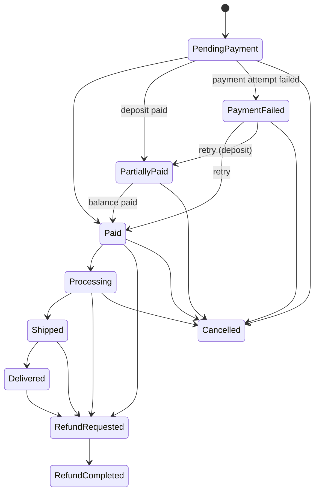
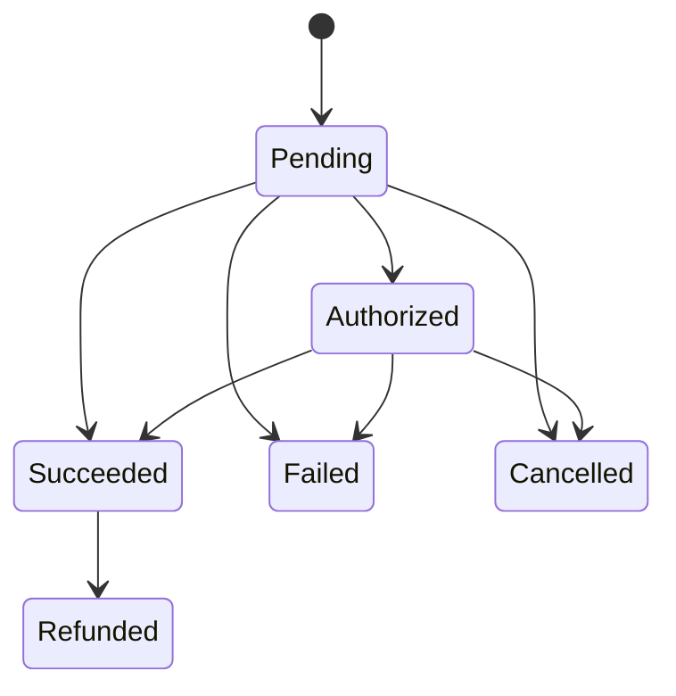
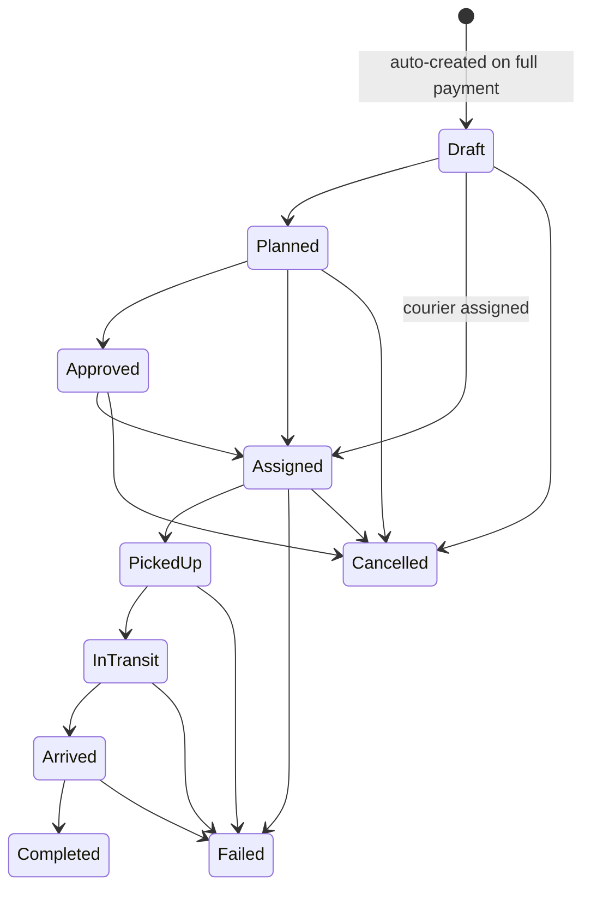
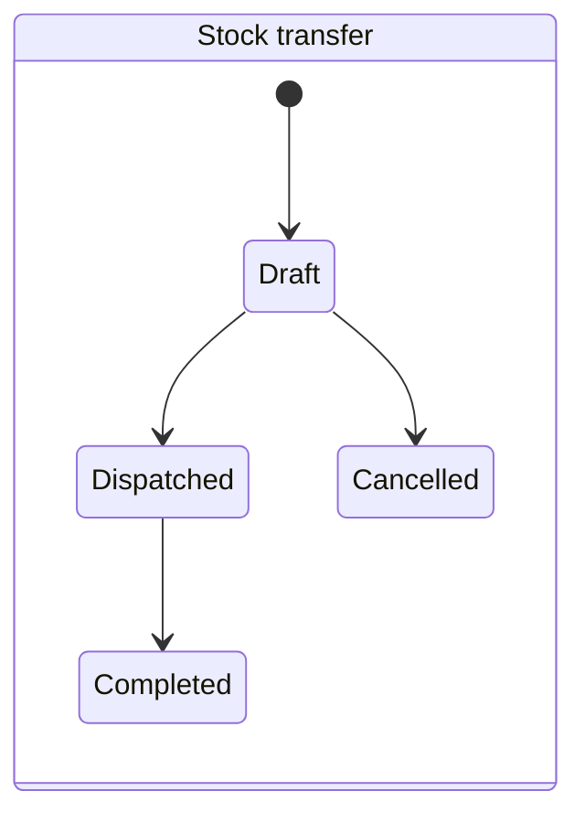
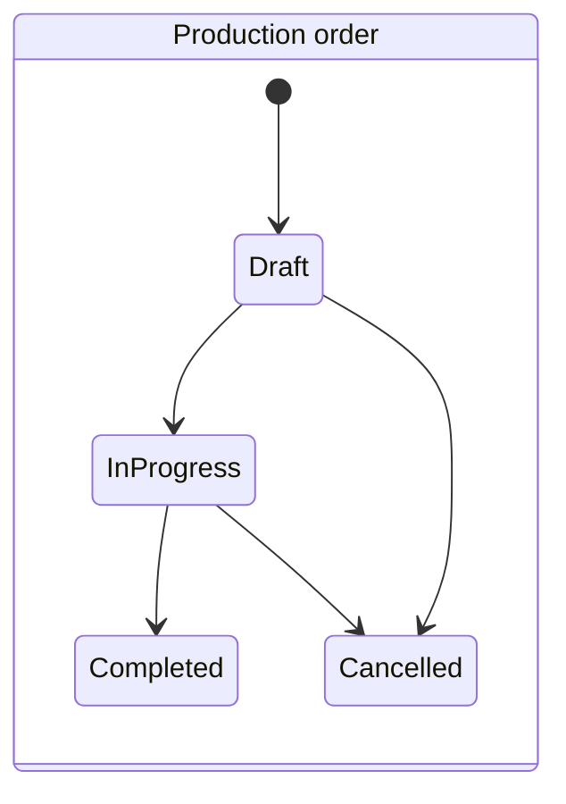
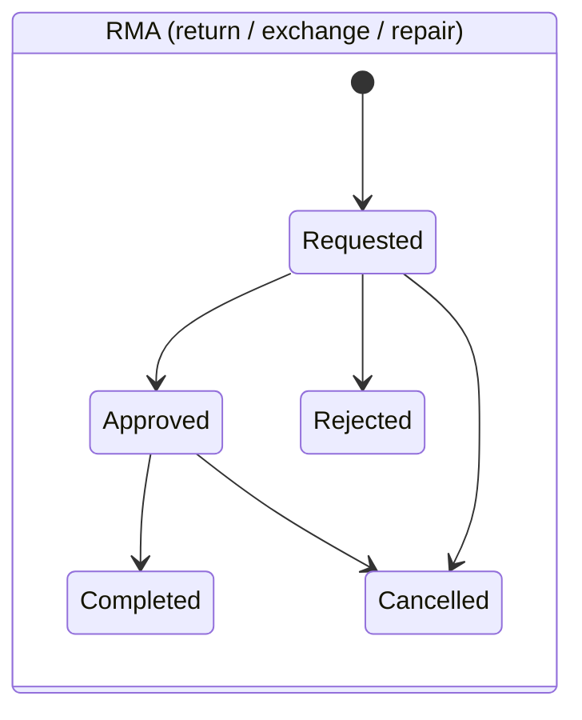

# Domain model & state machines

Six entities have an explicit lifecycle. Each one declares a static transition map, and every status change goes through a single guard (`StateMachine.EnsureTransition`). An invalid jump throws a `BusinessRuleException` with a stable code (for example `ORDER_INVALID_TRANSITION`) and surfaces as HTTP 422.

Design choice: this is a **hand-rolled ~30-line helper**, not a workflow library. The transition maps are data, the guard is one method, and everything is unit-testable without any infrastructure. For lifecycles of this size, a library would add dependency weight without adding safety.

## Order

Notes:
- `PaymentFailed` is deliberately **not** `Cancelled`: a failed card attempt is a retryable situation, and the two must not be confused in reporting.
- `PartiallyPaid` exists because of deposit selling: money has been taken, but the order is not fully paid.
- The money side lives next to the status: `TotalAmount`, `AmountPaid`, `OutstandingAmount` and an optional `DepositAmount`. `RegisterPayment` rejects overpayment and derives the right status from the balance — callers never set `Paid` by hand.

## Payment

A payment can only be refunded after it succeeded. On top of these guards, the service layer *claims* the `Pending → final` transition with one conditional `UPDATE`, so two concurrent confirmations of the same payment cannot both apply their effects.

## Fulfillment (delivery)

The courier steps must happen in order — `InTransit → Completed` (skipping `Arrived`) is rejected. Couriers may only advance deliveries assigned to them, and only through the delivery states; this ownership rule is enforced in the service layer.

## Stock transfer / Production / RMA

These three share a pattern: **the status change and its real-world effect are welded together in one transaction** in the service layer.

| Entity | Transition | Effect |
|---|---|---|
| Transfer | create | reserve quantity at the source warehouse (atomic ATP check) |
| Transfer | Dispatched | ship from source (on-hand −, reserved −) |
| Transfer | Completed | receive at destination (on-hand +) |
| Transfer | Cancelled | release the source reservation (only possible while Draft) |
| Production | Completed | receive the produced quantity into the target warehouse |
| RMA (return/exchange) | Completed | receive the returned goods back into stock |
| RMA (return) | Completed | move the order into the refund flow |

RMA also enforces business limits up front: the quantity cannot exceed what was ordered for that product, and a refund cannot exceed the amount actually paid.

## Invariants outside the state machines

- **Server-authoritative pricing.** Order totals are computed from the catalog at checkout; client-sent prices and currencies are ignored. Mixed-currency orders are rejected.
- **ATP arithmetic.** `AvailableToPromise = OnHand − Reserved`; shipping consumes both; a stock-count correction can never go below the reserved amount.
- **Deposit consistency.** If an order line is customized before payment, the order total is recalculated and the deposit amount is scaled by the same ratio, so the deposit plan never goes stale.
