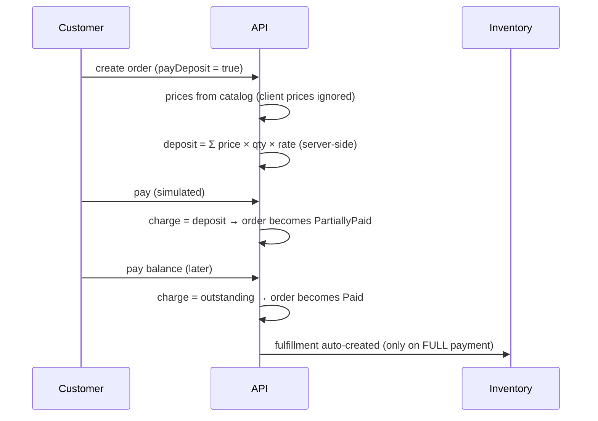

# Operations flows

The flows below are the heart of the system — what actually happens between "customer pays" and "customer has the product". All of them were verified end-to-end against the live environment, not only with unit tests.

## 1. Checkout with a deposit

A seller can enable deposit selling per product with a rate (for example 0.30). If **every** item in the cart allows it, checkout offers "pay deposit now, balance later".



Key rule: fulfillment starts only when the order is fully paid — a deposit alone does not ship goods.

## 2. Stock reservation without overselling

The dangerous moment in any shop: two customers, one unit left. OpsCommerce reserves with a single conditional update:

```sql
UPDATE InventoryItems
SET    QuantityReserved = QuantityReserved + @qty
WHERE  Id = @id
  AND  QuantityOnHand - QuantityReserved >= @qty
```

Zero rows affected = insufficient stock. The database serializes the two racers; exactly one succeeds. Order-level reservation loops over the lines **inside one transaction**, so a partial failure rolls everything back and no stock stays locked by a half-reserved order.

Every reservation carries a TTL. A background worker sweeps expired ones every minute, returns the stock atomically and writes an `Expired` audit entry as `system`. A committed reservation is the shipping moment: reserved and on-hand both go down.

## 3. Warehouse-to-warehouse transfer

| Step | Who | Stock effect |
|---|---|---|
| Create | warehouse | reserve at source (atomic ATP check — can't promise what another order holds) |
| Dispatch | warehouse | on-hand − and reserved − at source: goods are on the road |
| Complete | warehouse | on-hand + at destination (row auto-created on first arrival) |
| Cancel | warehouse | release the source reservation — only while still Draft |

The transfer UI is stock-aware: choosing a source warehouse lists only the products that are actually in stock there, with their ATP numbers, and shows how many units the destination already holds.

## 4. Courier delivery

1. Full payment auto-creates a fulfillment operation (Draft).
2. Operations assigns a courier — the assignee must really have the Courier role **and** belong to the same company (checked against the identity store, not trusted from input).
3. The courier's own screen lists only their deliveries; they advance step by step: *Picked up → On the road → Arrived → Delivered*. Skipping a step is rejected by the state machine; advancing someone else's delivery is rejected by the ownership check.

## 5. Returns (RMA)

Anyone who can prove they own the order can open a request: a registered customer from the account area, or a guest with the order's guest token.

Validations happen at request time — the quantity cannot exceed what was ordered for that product, the restock warehouse must belong to the order's company. On approval + completion, the effects apply in one transaction:

- **Return / exchange** → returned units go back into warehouse stock.
- **Return** → the order moves through the refund flow (`RefundRequested → RefundCompleted`), and the refund amount cannot exceed what was actually paid.
- **Repair** → no stock or money effect, just the tracked workflow.

## 6. Production to stock

A production order is manufacturing without a sale: choose a product, a quantity and a target warehouse. `Draft → InProgress → Completed`; completion receives the produced units into the target warehouse — the same intake path a transfer arrival uses.

## 7. The audit trail ties it together

Every step above writes an activity entry **in the same transaction** as the step itself: entity, action, human-readable details, the acting user and the related order. The result is that any order can be replayed end-to-end — creation, failed and retried payments, status changes, courier hops, refunds — and both the operations panel and the customer's account show that timeline.
